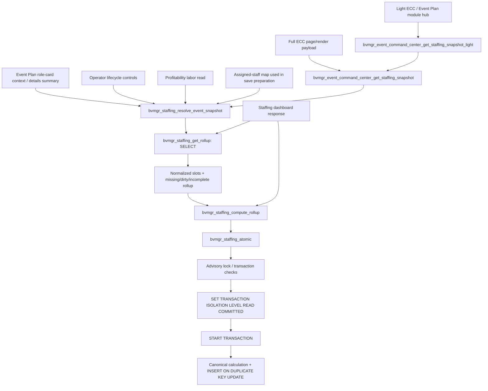

# Staffing snapshots: read and write contracts

Staffing display must answer from canonical slots, lifecycle assignments, role metadata, shift windows and availability without repairing persistent rollups. A dirty marker is a maintenance hint, not permission for a GET request to write.

`bvmgr_staffing_resolve_event_snapshot()` is the effective read API. It reads persisted rollup metadata for diagnostics, calls `bvmgr_staffing_derive_rollup()` in memory, and combines the result with the existing role/activation/lifecycle projection. Derivation also runs when a stored rollup appears current: marker or timestamp checks alone cannot detect changed assignments, cross-event conflicts, rates or availability. Counts, conflicts and estimates never come from unverified stored values. No new persistent cache, option, version marker or migration is introduced.

`bvmgr_staffing_get_rollup()` remains a raw, SELECT-only storage inspection API for diagnostics and maintenance. Display consumers requiring effective truth use the resolver. Existing `skip_rollup_recompute` arguments are harmless but unnecessary: the resolver cannot persist with either value.

`bvmgr_staffing_compute_rollup()` retains its explicit writer contract and existing transaction service. It calls the same calculation function, then performs the existing prepared upsert. `bvmgr_staffing_mark_rollup_dirty()` remains the explicit invalidation writer. Lifecycle actions still change assignment, audit and dirty markers within one managed transaction; a display read leaves those markers intact. Explicit template application, matrix saves and maintenance rebuilds still persist results.

The existing financial authority uses a separate repeatable-read, READ ONLY transaction and shared advisory lock to obtain a coherent labor estimate. This transaction is for reading canonical values, not cache repair. Its SQL, actor/capability checks, lifecycle transaction service and concurrency behavior are unchanged.

## Exact former write-on-read graph

The promotion guard caught `X`; the exception could be handled by the caller while a page continued rendering. Regression tests therefore inspect attempted statements even when no exception escapes.

After this change, both resolver and staffing dashboard use in-memory derivation. Their graphs have no edge to `compute_rollup`, `mark_rollup_dirty`, mutation audit, or the writer transaction service.

## Read surface inventory

| Surface | Entry/call chain | Classification before fix |
| --- | --- | --- |
| Full ECC | `bvmgr_event_command_center_render_page_content` → `build_payload` → `get_staffing_snapshot` → resolver | INVALID READ-TIME WRITE |
| Light ECC/module summary | `render_event_plan_module_hub_metabox` → `build_module_hub_payload` → `get_staffing_snapshot_light` → full snapshot → resolver | INVALID READ-TIME WRITE |
| Event Plan role cards | `BVMGR_Admin_Event_Plans::get_event_plan_staff_render_context` → resolver → `render_event_plan_staff_response_html` | INVALID READ-TIME WRITE |
| Event Plan details/boot summary | `render_event_plan_details_meta_box` → resolver | INVALID READ-TIME WRITE |
| Operator lifecycle display | `bvmgr_staffing_render_lifecycle_controls` → resolver | INVALID READ-TIME WRITE |
| Profitability | `bvmgr_event_profitability_get_labor_cost_cents` → resolver | INVALID READ-TIME WRITE |
| Staffing dashboard | `bvmgr_staffing_build_dashboard_response` → raw rollup read → compute/persist | INVALID READ-TIME WRITE |
| Shared assigned-staff map | `bvmgr_staffing_get_event_assigned_staff_map` → resolver; called by Event Plan save preparation | Read helper had the same implicit write; removed regardless of caller context |
| Staff portal assigned event cards/crew | `get_assignment_rows`, `get_event_crew_rows`, `render_assigned_event_cards`; canonical SELECT helpers | Existing read path; no direct rollup writer; exercised by write trap |
| Event Plan/ECC financial authority | `bvmgr_financial_get_event_snapshot`, `bvmgr_event_command_center_get_financial_snapshot` → `bvmgr_staffing_get_financial_labor` | Existing explicit read-only labor authority; preserved |
| Staffing Rollups admin GET/preview | `bvmgr_staffing_admin_render_rollups_page`: dirty-count SELECT; rebuild preview returns before writes | Existing read/preview; real rebuild is POST-only |

## Complete rollup writer inventory

Source search covers every reference to the rollup table suffix, table-name lookup, recompute, dirty flag, rebuild and seed functions in `includes`, `scripts` and `tests`.

| Writer/callsite | Classification | Contract |
| --- | --- | --- |
| `bvmgr_staffing_mark_rollup_dirty` | VALID MUTATION PATH primitive | Prepared insert/upsert creates/sets dirty marker and reason; does not clear it |
| `bvmgr_staffing_compute_rollup` | VALID MUTATION / EXPLICIT MAINTENANCE primitive | Existing prepared rollup upsert; clears dirty/reason after explicit computation inside `bvmgr_staffing_atomic` |
| Resolver implicit recompute | INVALID READ-TIME WRITE | Removed |
| Staffing dashboard implicit recompute | INVALID READ-TIME WRITE | Removed |
| `bvmgr_staffing_apply_template_to_event` → dirty + compute | VALID MUTATION PATH | Explicit Event Plan template application during authorized save; existing transaction wrapper |
| `bvmgr_staffing_seed_event_slots_from_template` → dirty + compute | VALID MUTATION PATH | Explicit/queued template seeding, not display |
| `bvmgr_staffing_save_event_roles_matrix` → dirty + compute + audit | VALID MUTATION PATH | Explicit matrix save, existing managed transaction |
| `bvmgr_staffing_lifecycle_dirty` → dirty for affected plans | VALID MUTATION PATH | Assignment creation, transition, reproposal, cancellation, window changes; lifecycle service transaction/audit retained |
| Event Plan save callback → dirty | VALID MUTATION PATH | Existing save/revision/autosave/effective-change gates retained |
| Event Plan save → `queue_seed_event_slots` → queued seed handler → seed | VALID MUTATION / MAINTENANCE PATH | Existing authorized save scheduling and maintenance job, not render |
| Schedule event creation → seed | VALID MUTATION PATH | Existing explicit scheduling/creation action in `includes/admin/schedule.php` |
| `bvmgr_staffing_rebuild_rollups` → compute + rebuild audit | VALID EXPLICIT MAINTENANCE PATH | Existing filter-scoped rebuild; admin capability + POST + nonce; preview returns before writing |
| Vendor-core v7 migration (`includes/db/migrations.php`) | VALID EXPLICIT MIGRATION PATH | Existing schema creation via `dbDelta`; unchanged; no new migration |
| Lifecycle migration/preflight | Existing migration / READ ONLY preflight | Schema/identity inspection includes rollups; no new rollup-repair-on-read path |
| Tests/helpers | Explicit disposable fixtures / negative controls | May insert/delete/dirty/corrupt rollups only to construct test states; never normal Local |

No separate production rollup delete callsite or unclassified rollup writer was found. The raw storage getter and preflight population queries do not write. No public endpoint's authentication, authorization, nonce handling, sanitization or escaping was changed.

## Staleness and provenance

| Stored state | Effective answer | Storage effect |
| --- | --- | --- |
| Current, verified against canonical calculation | Current counts/conflicts/estimates; `persisted_current_verified` | None |
| Missing | Current calculation; `derived_missing` | None; no insert |
| Dirty | Current calculation; `derived_dirty` | None; dirty marker retained |
| Incomplete projection | Current calculation; `derived_incomplete` | None |
| Stale values, including slots/assignments changed without marker | Current calculation; `derived_stale` | None |
| Malformed timestamp | Current calculation; `derived_malformed` | None |
| Legacy-only assignments | Existing legacy count/unknown-lifecycle semantics | None; no migration |

The snapshot keeps the stored computation timestamp separately (`rollup_persisted_computed_at`) and exposes storage state/provenance and existing missing/dirty/incomplete flags to diagnostics. Ordinary operator labels remain the existing readiness, staffing and financial labels.

## Regression boundaries

`tests/staffing-lifecycle/readonly-surfaces.php` runs only through the explicit disposable bootstrap. Its strict SQL trap rejects writes, schema changes and repair transactions, and records attempts before throwing so swallowed exceptions cannot hide violations. It permits only the existing financial helper's own consistent read transaction/lock. Every table's schema and sorted row hashes are compared for each surface/state, covering options, audits and rollups as well as business data. Lifecycle transitions are real SQL operations outside the read trap; subsequent reads are checked under the trap. Tests also create stale cross-event overlap and availability state to prove conflicts are calculated fresh.

The test copy's hardcoded disposable paths are remapped only to the new owned runtime, while runtime source stays exact. Normal Local, the original dirty checkout, companion sources and protected stash are preservation boundaries. A future promotion still requires a separate fresh read-only normal-local preflight, rollback archive and explicit promotion authorization.
